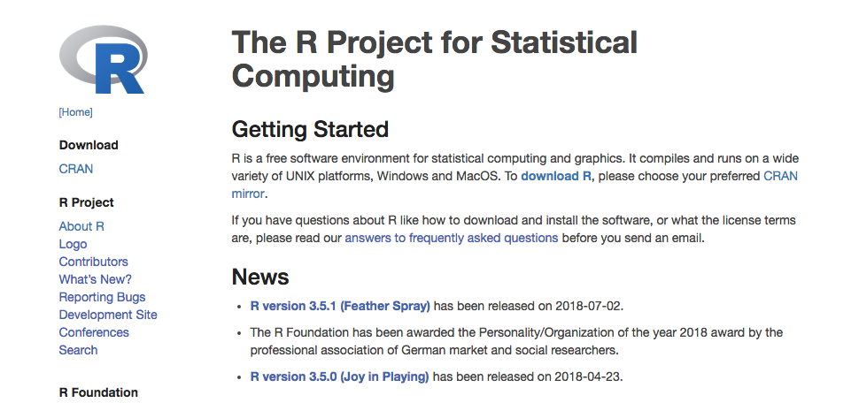
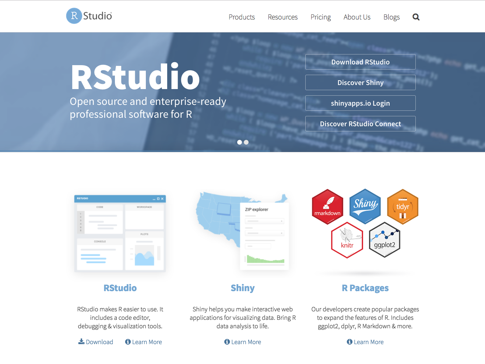

## Getting Started

### Download R
Click on the link to go to R's homepage. <https://www.r-project.org/>



To download R:

1. Click the **download R** link under Getting Started.
2. Select your CRAN mirror. Click one of the links at the top under 0-Cloud.
3. Click on the link that says "Download R for [Your Operating System]"
4. What to Pick
    - For Mac, select the latest release
    - For Windows, select base
    - For Linux, select your distribution and follow the instructions in the README.html file.
5. R should be downloaded to your computer and you should follow the normal steps to install

### Download RStudio

Click on the link to go to R's homepage. <https://www.rstudio.com/>



To download RStudio:

1. Click the Download link underneath the RStudio cartoon.
2. Click the DOWNLOAD button for the FREE RStudio Desktop.
3. Select your operating system from the list.
4. The file should download to your computer and then you can install it like any other program.

### Install Packages
To install the main packages that will be required for meetups, open RStudio and copy and paste the code below into the **Console**.

```r
install.packages(c('tidyverse', 'viridis', 'conflicted'))
```
If that doesn't work, copy and paste this code.

```r
packages <- c('dplyr', 'forcats', 'ggplot2', 'purrr', 'readr', 'stringr', 'tibble', 'tidyr', 'viridis', 'conflicted')
install.packages(packages)
```

### Install TeX

TeX is a computer language/program for typesetting, particulary for math and other technical typesetting. RStudio needs it installed on your computer in order to create PDFs from your R markdown documents. To install, follow the instructions for your operating system below.

**Mac:**

1. To install MacTeX, go here <http://www.tug.org/mactex/>
2. Click on MacTeX Download
3. Click on MacTeX.pkg
4. Install like any other program

Note: If you have RStudio open, you'll need to restart before you can knit a PDF.

**Windows:**

1. To install MiKTeX, go here <https://miktex.org/download>
2. Click Download
3. Execute the .exe files like normal
4. During installation select the options below. Otherwise install as you normally do. 
    - Install MiKTeX for anyone who uses the computer.
    - Install missing packages on-the-fly: Yes

Note: If you have RStudio open, you'll need to restart before you can knit a PDF.

**Linux:**

In terminal `sudo apt-get install texlive-full`

Note: If you have RStudio open, you'll need to restart before you can knit a PDF.

## Resources

Reference material used while creating material for meetups:

1. [R for Data Science](http://r4ds.had.co.nz/) by Hadley Wickham
2. [Advanced R](http://adv-r.had.co.nz/) by Hadley Wickham
3. Temple's BIO5312, [Biostatistics Fall 2017](http://sjspielman.org/bio5312_fall2017/) by Stephanie Spielman

---

# Content
### Week 1 (Sep 7)

**Introduction to the class and Rmarkdown**

- Introduction to meetups
- Getting started with R and RStudio
- Rmarkdown

**Materials**

- [slides](week1/bioinformatics_meetup_introduction_2018.09.07.pdf)
- Introduction to Rmarkdown [in Rmd](week1/intro_to_rmarkdown.Rmd), [html](week1/intro_to_rmarkdown.html), [word document](week1/intro_to_rmarkdown.docx), and [pdf](week1/intro_to_rmarkdown.pdf)
- Practice for the week is [here](week1/week1_intro_to_rmarkdown_practice.Rmd) and answers are [here in R markdown](week1/week1_intro_to_rmarkdown_practice_ANSWERKEY.Rmd) and [in html](week1/week1_intro_to_rmarkdown_practice_ANSWERKEY.html)

**References**

- [Rmarkdown cheat sheet](https://www.rstudio.com/wp-content/uploads/2015/02/rmarkdown-cheatsheet.pdf)

---

### Week 2 (Sep 14)

**Subsetting and filtering**

- Examining tables
- Subsetting
- Filtering and Selecting

**Materials**

- Demo in [Rmd](week2/examine_subset_filter_data.Rmd) and in [html](week2/examine_subset_filter_data.html)
- Practice for the week is [here](week2/wee2_practice_examine_filter_subset_data.Rmd) and answers are [here in Rmd](week2/wee2_practice_examine_filter_subset_data_ANSWERS.Rmd) and [in html](wee2_practice_examine_filter_subset_data_ANSWERS.html)

___

### Week 3 (Sep 21)

**Plotting with ggplot**

- Background on ggplot and review data types
- ggplot demonstration

**Materials**

- [slides](week3/2018.09.21_meetup_Plotting_with_ggplot2.pdf)
- ggplot demo [Rmd file](week3/plotting_w_ggplot.Rmd), [html](week3/plotting_w_ggplot.html)
- updated demo file with extras discussed in meetup, [Rmd file](week3/plotting_w_ggplot_classwork.Rmd), [html](week3/plotting_w_ggplot_classwork.html)
- Practice for the week is [here](week3/week3_practice_plotting_with_ggplot.Rmd) and answers are [here in Rmd](week3/week3_practice_plotting_with_ggplot_ANSWERS.Rmd) and in [html](week3_practice_plotting_with_ggplot_ANSWERS.html)

**References**

- [ggplot cheatsheet](https://www.rstudio.com/wp-content/uploads/2015/03/ggplot2-cheatsheet.pdf)
- [viridis vignette](https://cran.r-project.org/web/packages/viridis/vignettes/intro-to-viridis.html)
- [ggbeeswarm vignette/GitHub README](https://github.com/eclarke/ggbeeswarm)
- [list of ggplot themes](https://jrnold.github.io/ggthemes/reference/index.html)
- [list of colors](week3/ColorChart.pdf) you can plot with in R 

---

**No meetup the week of Sep 28 because of thesis defense**

---

### Week 4 (Oct 5)

**Data manipulation with dplyr**

- dplyr functions
- piping

**Materials**

- week3 practice ggplot in class review [Rmd file](week3/week3_practice_plotting_with_ggplot_INCLASS_anwsers.Rmd)
- dplyr demo [Rmd file](week4/data_manipulation_w_dplyr.Rmd), [html file](week4/data_manipulation_w_dplyr.html)
- dplyr demo with in class extras [Rmd file](week4/data_manipulation_w_dplyr_INCLASSwork.Rmd)
- practice [Rmd](week4/week4_practice_data_manipulation_w_dplyr.Rmd) and answers in [Rmd](week4/week4_practice_data_manipulation_w_dplyr_ANSWERS.Rmd) and in [html](week4/week4_practice_data_manipulation_w_dplyr_ANSWERS.Rmd) and answer [Rmd](week4_practice_data_manipulation_w_dplyr_INCLASS.Rmd) with in class solutions and extra comments

**References**

- [dplyr cheatsheet](https://www.rstudio.com/wp-content/uploads/2015/02/data-wrangling-cheatsheet.pdf)

---

### Week 5 (Oct 12)

**Data Wrangling with tidyr**

- the tidyverse
- tidy data
- data wrangling
    - tidyr functions
    - binds and joins
    - dealing with NAs

**Materials**

- [slides](week5/the_tidyverse_and_tidy_data.pdf)
- data wrangling demo [Rmd](week5/data_wrangling_w_tidyr.Rmd), [html](week5/data_wrangling_w_tidyr.html)
- tidyr/data wrangling demo with in class additions [Rmd](week5/data_wrangling_w_tidyr_INCLASS.Rmd)
- data wrangling [practice](week5/week5_practice_data_wrangling_w_tidyr.Rmd) and answers in [Rmd](week5/week5_practice_data_wrangling_w_tidyr_ANSWERS.Rmd) and in [html](week5/week5_practice_data_wrangling_w_tidyr_ANSWERS.Rmd) and in-class answers in [Rmd](week5/week5_practice_data_wrangling_w_tidyr_INCLASS.Rmd)

**References**

- data wrangling [cheat sheet](https://www.rstudio.com/wp-content/uploads/2015/02/data-wrangling-cheatsheet.pdf)
- Hadley Wickhams tidy data [paper](http://vita.had.co.nz/papers/tidy-data.pdf)

---

### Week 6 (Oct 19)

**Basic Statistics in R**

- descriptive and summary statistics
- hypothesis testing
    - t test
    - chi squared
- tidying the test
- correcting for multiple testing

**Materials**

- [slides](week6/statistics_review.pdf)
- practice [Rmd](week6/week6_practice_stats_in_R.Rmd) and answers in [Rmd](week6/week6_practice_stats_in_R_ANSWERS.Rmd) and in [html](week6/week6_practice_stats_in_R_ANSWERS.html)

---

### Week 7 (Oct 26)

**Import/Export Data and Review**

- read/write data
- combine skills from all weeks

**Materials**

- [slides](week7/reading_and_writing_data.pdf)
- demo [Rmd](week7/import_data_and_review.Rmd), [html](week7/import_data_and_review.html), and the in-class [Rmd](week7/import_data_and_review_INCLASS.Rmd)
- practice [Rmd](week7/week7_practice_combine_skills.Rmd) and answers in [Rmd](week7/week7_practice_combine_skills_ANSWERS.Rmd) and in [html](week7/week7_practice_combine_skills_ANSWERS.html) and from class in [Rmd](week7/week7_practice_combine_skills_INCLASS.Rmd)
- practice datasets
    - [sparrows](week7/practice_files/sparrows2.csv)
    - [wine](week7/practice_files/wine2.tsv)
    - [rowan](week7/practice_files/rowan2.csv)

**References**

- data import [cheat sheet](https://ugoproto.github.io/ugo_r_doc/data-import.pdf)

---

### Week 8

**Linear Modeling and tidying models with broom**

- Review correlation and linear regression
- Linear modeling functions
- broom

**Materials**

- [slides](week8/correlation_and_linear_regression_conceptual_review.pdf)
- demo [Rmd](week8/linear_modeling_and_broom.Rmd) and in class demo [Rmd](week8/linear_modeling_and_broom_INCLASS.Rmd)
- practice [Rmd](week8/week8_practice_linear_modeling_and_broom.Rmd) and [html](week8/week8_practice_linear_modeling_and_broom.html) and answers in [Rmd](week8/week8_practice_linear_modeling_and_broom_ANSWERS.Rmd) and in [html](week8/week8_practice_linear_modeling_and_broom_ANSWERS.html) and in class review [Rmd](week8/week8_practice_linear_modeling_and_broom_INCLASS.Rmd)

**References**

- [broom vignette](https://broom.tidyverse.org/articles/broom.html)

---

### Week 9

**Clustering**

- Review linear modeling and broom
- clustering
    - kmeans
    - PCA
    - tSNE
 
**Materials**
 
 - [slides](week9/clustering.pdf)
 - demo [Rmd](week9/clustering.Rmd) and in class demo in [Rmd](week9/clustering_INCLASS.Rmd)
 - practice in [Rmd](week9/week9_practice_clustering.Rmd) and in [html](week9/week9_practice_clustering.html) 
 - practice datasets
     - [wine](week9/wine.csv)
     - [biopsy](week9/biopsy.csv)

---

### Week 10

**Plotting grab bag**

- Review clustering
- miscellaneous plots
    - cowplot
    - volcano plot
    - MA plot

**Materials**

- demo [Rmd](week10/plotting_grab_bag.Rmd)
- demo [data](week10/demo_diff_exp_tbl.tsv)

**References**

- cowplot [vignette](https://cran.r-project.org/web/packages/cowplot/vignettes/introduction.html)

<br><br>

---

<a rel="license" href="http://creativecommons.org/licenses/by-nc-sa/4.0/"></a><br />This work is licensed under a <a rel="license" href="http://creativecommons.org/licenses/by-nc-sa/4.0/">Creative Commons Attribution-NonCommercial-ShareAlike 4.0 International License</a>.
